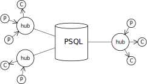

# pg-hub
<a href="https://npmjs.org/package/pg-hub" title="View this project on NPM"></a>
<a href="https://npmjs.org/package/pg-hub" title="View this project on NPM"></a>
[](https://opensource.org/licenses/ISC)
[](https://github.com/mkenney/software-guides/blob/master/STABILITY-BADGES.md#beta)


Lightweight event infrastructure built on PostgreSQL Notify/Listen.

## install
```sh
npm i pg-hub
```
## overview
The **pg-hub** package provides lightweight event routing infrastructure based on
PostgreSQL *notify* and *listen*. In basic use cases, it enables database
triggers to send events to a node client application. In more sophisticated systems, the
RDBMS becomes a top-level broker, enabling database logic and multiple node clients to produce
and consume events.

<p align="center"></p>

Each event includes three fields, *topic*, *keys*, and *value*. The *topic* is an alphanumeric 
string that corresponds directly to a PSQL notification channel. The *keys* field contains an ordered list of
64-bit signed integers, and the *value* field is a JSON object. The *keys* and *value* fields are encoded into the
notification payload, while the *topic* field corresponds to a PostgreSQL [notification channel](https://www.postgresql.org/docs/current/sql-listen.html).

## example
```js
import Pg from 'pg'
import PgHub from 'pg-hub'

const pool = new Pg.Pool(config);
const hub = new PgHub.Hub(pool, 5000);

const result1 = await hub.start();

const consumer = hub.consumer((event) => console.log('topic=' + event.topic + ' key=' + event.key + ' value=' + event.value));
consumer.subscribe('topic1');

hub.notify('topic1');
hub.notify('topic1', 100n, {a:1, b:'text', c:[0,1,4]});
hub.notify('topic1', [101n,102n,103n], {a:2, b:{d:1, e:'xyzzy'}, c:[0,1,4]});
hub.notify('topic1', null, [1,2,3]);
hub.notify('topic1', 42n, null);

await new Promise((resolve) => setTimeout(resolve, 1000));

const result2 = await hub.stop();

```

### nodejs details
The pg-hub object model includes **Hub** and **Consumer** object classes. The Hub class wraps a PostgreSQL
connection using **[node-postgres](https://github.com/brianc/node-postgres)**. Hub objects support event producers
with an outbound *notify* method, and they allow creation of event consumers with a *consumer* method. The Consumer
class represents an event consumer. Consumer objects wrap a callback hook, which receives events based on one or more
topic subscriptions.
#### hub object
A hub is created as follows:
```js
import PgHub from 'pg-hub';
const hub = new PgHub.Hub(pool, reconnectTime, logger, name);
```
The **Hub** constructor includes four parameters, *pool*, *reconnectTime*, *logger*, and *name*. The
*pool* parameter is a **Pg.Pool** object, used to connect to the PostgreSQL server. The *reconnectTime*
parameter is the time, in milliseconds, that the hub waits between connection (or reconnection) attempts.
If inluded, the *logger* parameter contains an object that exposes four logging methods,
`debug()`, `info()`, `warn()`, and `error()`. The methods may be set to null to disable the corresponding
level of logging, and the logger parameter may be omitted (or set to null) to disable logging altogether.
The *name* parameter includes an optional symbolic name, which is exposed through the object's `name` property
but not otherwise used by the hub object itself.

Once created, a hub exposes four public methods: `start()`, `stop()`, `notify()`, and `consumer()`.
The *start* method opens a connection to the database, drawing a persistent client from the *pool*
parameter passed during construction. The *stop* method likewise closes down the connection
and releases associated resources, allowing the caller to *await* final completion. The *notify*
method sends an outbound event, and the the *consumer* method creates a Consumer object to receive
inbound events.
```js
hub.start();
const consumer = hub.consumer(event => {});
hub.notify(topic, key, value);
await hub.stop();
```
#### consumer object
```js
const consumer = hub.consumer(event => {});
consumer.subsribe('topic0');
consumer.subscribe(['topic1, 'topic2']);
consumer.close();
```
#### supervisory notifications
A hub can produce six supervisory notifications, received by consumers as events
with a null *topic*, an empty set of *keys*, and a *value* object as follows:
```js
{action:'connect',final:false}
{action:'disconnect',final:false}
{action:'reconnect',final:false}
{action:'stop',final:true}
{action:'subscribe',topic:'topic_name',final:false}
{action:'close',final:true}
```
The *action* property describes the cause of notification, and the *final* property indicates
whether the notification is final. In the case of the *subscribe* action, the additional
*topic* field indicates the topic of the new subscription.

The *connect* action informs consumers that the hub has connected to the RDBMS and started normal
operations (see `start()` above). The *disconnect* action informs consumers that the hub has lost its connection,
and the *reconnect* action informs consumers that the connection has been restored. During the gap between a
disconnect and reconnect, events can be lost and consumers should act accordingly. The *stop* action
informs consumers that their associated hub has stopped operation (see `stop()` above). The *subscribe* action
informs the consumer that it has subscribed to the associated topic (see `subscribe()` above), and
the *close* notification informs the consumer that it has been closed (see `close()` above).

### PostgreSQL Interface

### Underlying Event Details
Events are encoded into text format, compatible with the PostgreSQL *notify* command. Implementation details
are available [here](./EVENT.md "Underlying Event Details")
